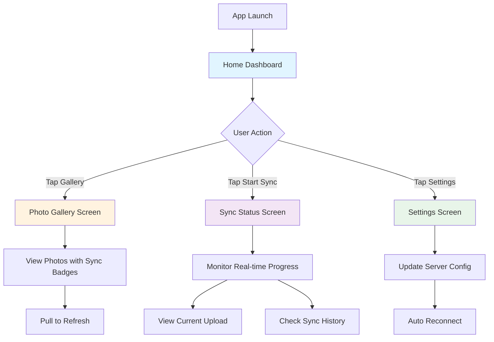

# PhotoSync Android App - UX Design Summary

## Visual Mockup


## Architecture Overview

**Current State**: Single-screen app with basic settings UI, backend-focused with minimal user feedback

**Proposed State**: Multi-screen MVVM app with 4 main screens, real-time status updates, and rich visual feedback

### Key Improvements

✅ **Proper Separation**: Backend (repositories, services, data) separated from Frontend (ViewModels, screens, components)

✅ **Reactive UI**: StateFlow-based updates for real-time sync progress and connection status

✅ **Better Navigation**: Bottom navigation bar for easy access to all features

✅ **Visual Feedback**: Progress bars, status indicators, photo badges, and animations

## Screen Breakdown

### 1. 🏠 Home Dashboard
**Purpose**: Quick overview and primary actions

**Features**:
- Connection status card with animated indicator (green = connected, red = disconnected, yellow = connecting)
- Sync statistics cards (total photos synced, last sync time, storage used)
- Quick action buttons ("Start Sync", "View Gallery")
- Clean, card-based Material Design 3 layout

**User Value**: See status at a glance, quick access to common actions

---

### 2. 🖼️ Photo Gallery
**Purpose**: Browse local photos and see sync status

**Features**:
- Grid layout of photo thumbnails (3 columns)
- Sync status badge on each photo (✓ green checkmark for synced, ⏱ clock for pending)
- Pull-to-refresh gesture
- Lazy loading for performance with large photo libraries
- Uses Coil for efficient image loading

**User Value**: Visual confirmation of which photos are backed up

---

### 3. 📊 Sync Status
**Purpose**: Monitor active sync operations and history

**Features**:
- Large progress bar showing overall sync progress (e.g., "67% - 234/350 photos")
- Current file card with thumbnail, filename, and upload speed
- Estimated time remaining
- Start/Stop sync button
- Sync history list (past syncs with timestamps and photo counts)

**User Value**: Transparency into sync process, ability to monitor and control uploads

---

### 4. ⚙️ Settings
**Purpose**: Configure app and server connection

**Features**:
- Server IP address input field
- Server port input field
- Auto-sync toggle (sync automatically when on WiFi)
- Permission management button
- Save & Reconnect button
- About section (app version, device ID)

**User Value**: Easy configuration, control over sync behavior

## Technical Architecture

### Backend Layer
```
data/          → Raw data access (DB, SharedPreferences, MediaStore)
model/         → Data models and sealed classes
repository/    → Business logic, StateFlow emissions
service/       → Background services (Connection, Sync)
```

### Frontend Layer
```
viewmodel/     → Presentation logic, state management
ui/screens/    → Screen composables
ui/components/ → Reusable UI components
ui/navigation/ → Navigation setup
ui/theme/      → Material Design 3 theming
```

### Data Flow
```
Service → Repository (StateFlow) → ViewModel → Screen (UI)
   ↓                                    ↓
Updates                            User Actions
   ↓                                    ↓
Repository ←─────────────────── ViewModel
```

## User Experience Flow



## Key UX Principles

1. **Transparency**: Users always know what's happening (connection status, sync progress)
2. **Control**: Users can start/stop sync, configure settings easily
3. **Feedback**: Visual indicators, progress bars, and status badges provide constant feedback
4. **Simplicity**: Bottom navigation makes all features accessible in 1 tap
5. **Performance**: Lazy loading, efficient image loading, background services

## Next Steps

1. Review this design and implementation plan
2. Approve or request changes
3. Implement backend layer (repositories, enhanced services)
4. Implement frontend layer (ViewModels, screens, navigation)
5. Test on device/emulator
6. Iterate based on feedback
