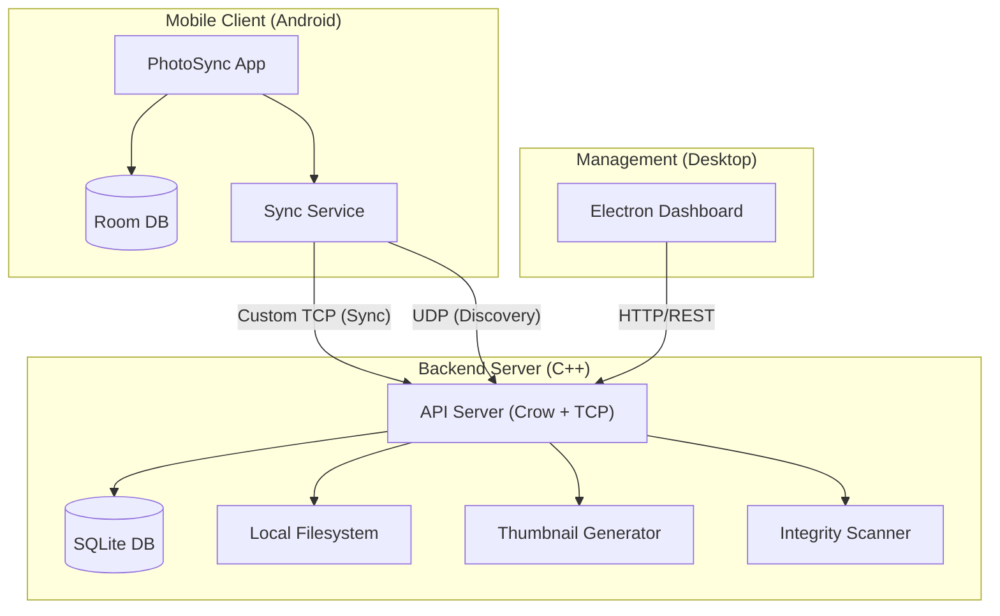

# PhotoSync Architecture Report

> [!NOTE]
> This report is based on a code audit of the `pics` repository performed on 2026-01-01.

## 1. Executive Summary

PhotoSync is a self-hosted photo synchronization solution designed to back up media from Android devices to a private server. The system comprises three main components:
1.  **Android Client**: A native Kotlin application for capturing and syncing media.
2.  **Server Backend**: A high-performance C++ server handling storage, thumbnail generation, and synchronization.
3.  **Dashboard**: A cross-platform desktop application (Electron/React) for managing the server and viewing photos.

## 2. System Architecture

The system employs a hybrid networking architecture:
- **Custom TCP Protocol**: Used between Android and Server for high-performance, low-overhead media transfer.
- **UDP Broadcast**: Used for local network discovery.
- **REST/HTTP (Crow)**: Used between the Dashboard and Server for management and media retrieval.

## 3. Component Deep Dive

### 3.1 Android Client (`/android`)
A modern native Android application built with **Kotlin** and **Jetpack Compose**.

*   **UI Architecture**: MVVM (Model-View-ViewModel) with unidirectional data flow.
*   **Key Libraries**:
    *   **UI**: Jetpack Compose (Material 3).
    *   **Image Loading**: Coil.
    *   **Concurrency**: Coroutines & Flow.
    *   **Data Persistence**: Room (SQLite).
    *   **WorkManager**: Manages reliable background sync tasks.
    *   **Paging 3**: Efficiently loads large photo libraries.
*   **Networking**:
    *   **Sync**: Custom `TcpSyncClient` implementing a raw TCP protocol for efficient binary transfer.
    *   **Discovery**: `UdpDiscoveryListener` for finding the server on the LAN.

### 3.2 Backend Server (`/server`)
A custom C++ 17/20 application designed for performance and control.

*   **Core Framework**: Custom `TcpListener` for sync, **Crow** microframework for HTTP API.
*   **Data Persistence**: **SQLite** (`DatabaseManager`) handling metadata, users, and session tracking.
*   **Media Handling**:
    *   Raw file storage on disk.
    *   On-the-fly or background thumbnail generation (`ThumbnailGenerator`) using `libjpeg-turbo` (likely) or standard image libs.
*   **Integrity**: Dedicated `IntegrityScanner` to detect missing, corrupt, or orphaned files.
*   **Security**: Implement custom challenge-response authentication (`AuthenticationManager`) and SSL/TLS support (`boost::asio::ssl`).

### 3.3 Dashboard (`/dashboard`)
A desktop-class management interface.

*   **Stack**: **Electron** wrapping a **React** Single Page Application (SPA).
*   **Build System**: **Vite** with **TypeScript**.
*   **UI Framework**: **Material UI (MUI)**.
*   **Communication**:
    *   **Socket.IO Client**: For real-time updates (server stats, sync progress).
    *   **Axios**: For REST API calls (configuration, browsing media).
*   **Features**: System health monitoring, real-time connection visualization, configuration management.

## 4. Key Workflows

### 4.1 Synchronization Flow
1.  **Discovery**: Android app broadcasts UDP packet; Server responds with IP/Port.
2.  **Handshake**: Client establishes TCP connection and authenticates.
3.  **Delta Check**: Client sends local media hash/timestamp; Server confirms if upload is needed.
4.  **Transfer**: Binary data streamed over TCP.
5.  **Finalize**: Server verifies hash, writes to disk, updates DB, and acks.

### 4.2 Dashboard Management
1.  **Dashboard Launch**: Connects to Server HTTP API (e.g., `http://localhost:port/api`).
2.  **Stats Polling**: Periodically fetches `/api/stats` and `/api/health`.
3.  **Media Browsing**: Fetches paginated lists via `/api/photos` and displays images via `/api/thumbnails/:id`.

## 5. Summary of Technologies

| Component | Language | Frameworks/Libs | Responsibility |
| :--- | :--- | :--- | :--- |
| **Android** | Kotlin | Compose, Room, WorkManager, Coil | Capture, Sync, Browse |
| **Server** | C++ (17/20) | Boost.Asio, Crow, SQLite, nlohmann/json | Storage, API, Sync Logic |
| **Dashboard** | TypeScript | Electron, React, Vite, MUI | Manage, Monitor, View |
